# Join - Kanban Management Tool
Join is a modern, responsive Kanban board application designed to streamline task management and team collaboration. Built with a focus on usability, Join offers an intuitive interface for managing tasks, organizing contacts, and monitoring progress in real-time.

## 🚀 Features

### 🔐 Authentication & User Access

- Guest Login: Quickly access the board without registration.  
- User Login/Signup: Register with name, email, and password.  
- Privacy Policy & Legal Notice: Available from both login and signup pages.  
- Secure Access: Users must accept the Privacy Policy before registration.  

### 📊 Summary Dashboard

View task statistics at a glance:  
- Total tasks  
- Closest upcoming deadline  
- Tasks per status: To Do, In Progress, Await Feedback, Done  
- Number of urgent tasks

### 🧩 Task Board (Kanban)
- Four status columns:

  - To Do  
  - In Progress  
  - Await Feedback  
  - Done  

- Drag-and-drop interface for task cards
- Search task through title and decription

- Clickable task cards to edit task details or delete task

### ➕ Task Management
- Multiple ways to add a task:

  - Within "To Do", "In Progress", or "Await Feedback" columns
  - Global “Add Task” button at the top
  - "Add Task" option in the navigation panel

- Required fields:

  - Title
  - Due date
  - Category

- Optional fields:

  - Description
  - Priority
  - Assigned contacts
  - Subtasks (can be edited or deleted)
 
### 👥 Contact Management
- Add, update, or delete contacts
- Use contacts for task assignments

### 📘 Help Section
Built-in guide on how to use the Kanban board and its features

### 🔄 Additional Features
- Logout: Securely end your session and return to the login page
- Responsive Design: Fully optimized for desktop, tablets, and mobile devices
- Realtime Sync: All data is stored and updated using Firebase Realtime Database

### 📱 Technologies Used
- HTML/CSS/JavaScript
- Firebase Realtime Database
- Responsive Design (Mobile & Tablet friendly)

### 🌐 Live Demo
[Try out the live version here](https://doratelekesi.github.io/Join/)

### 🛡️ License
This project is open source and available under the MIT License.

### Screenshots
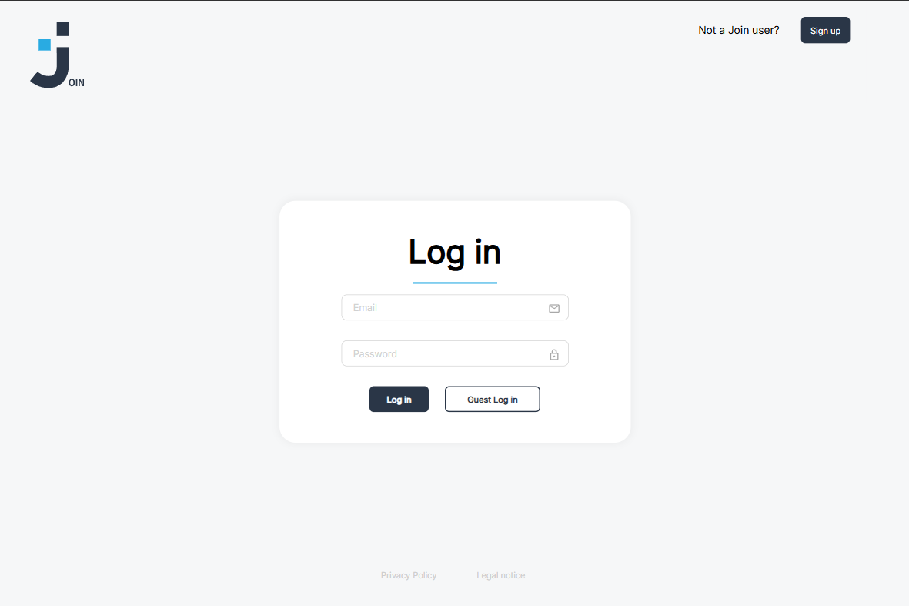
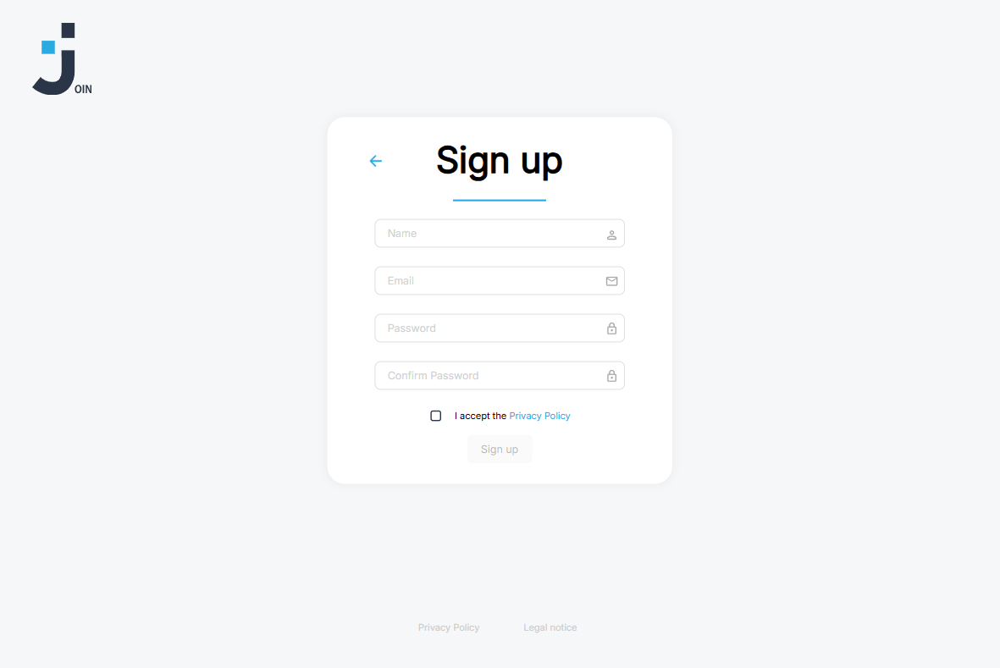
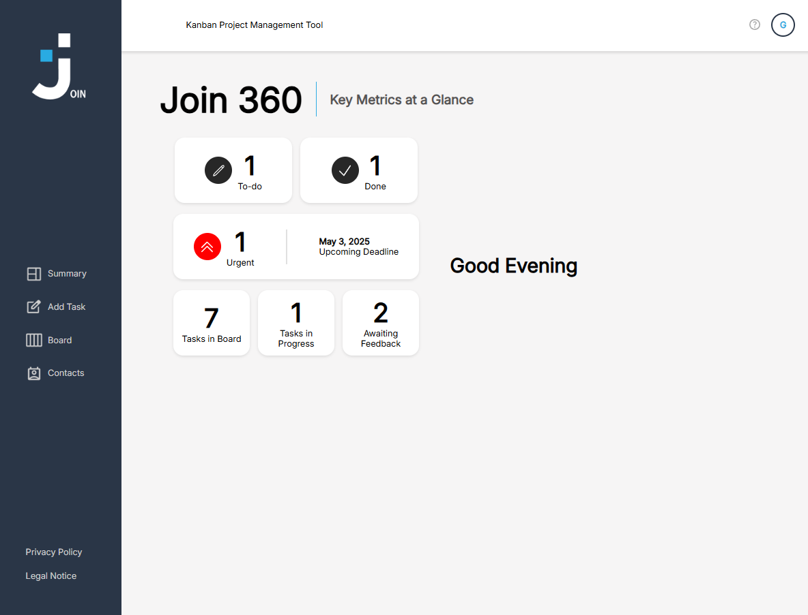
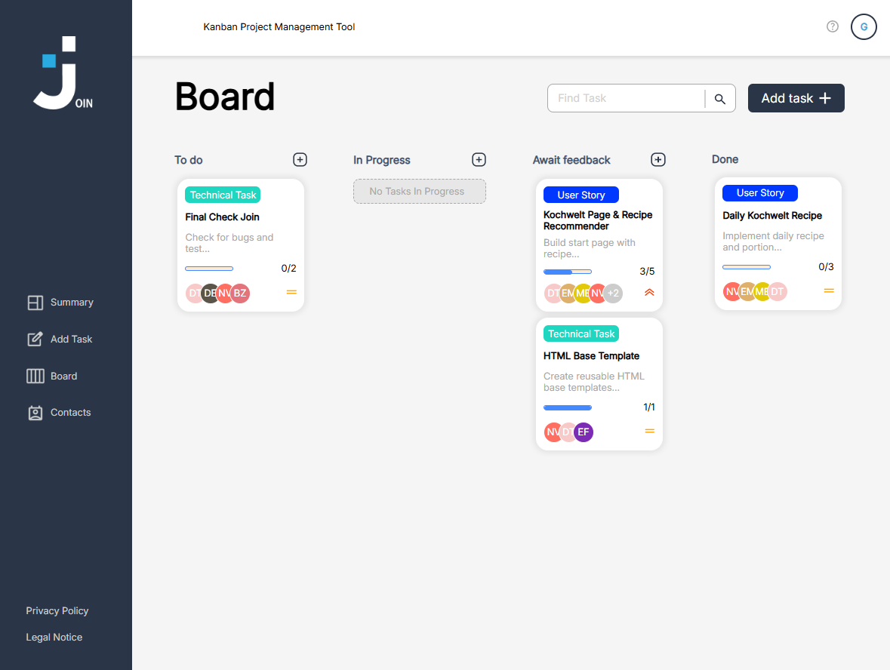
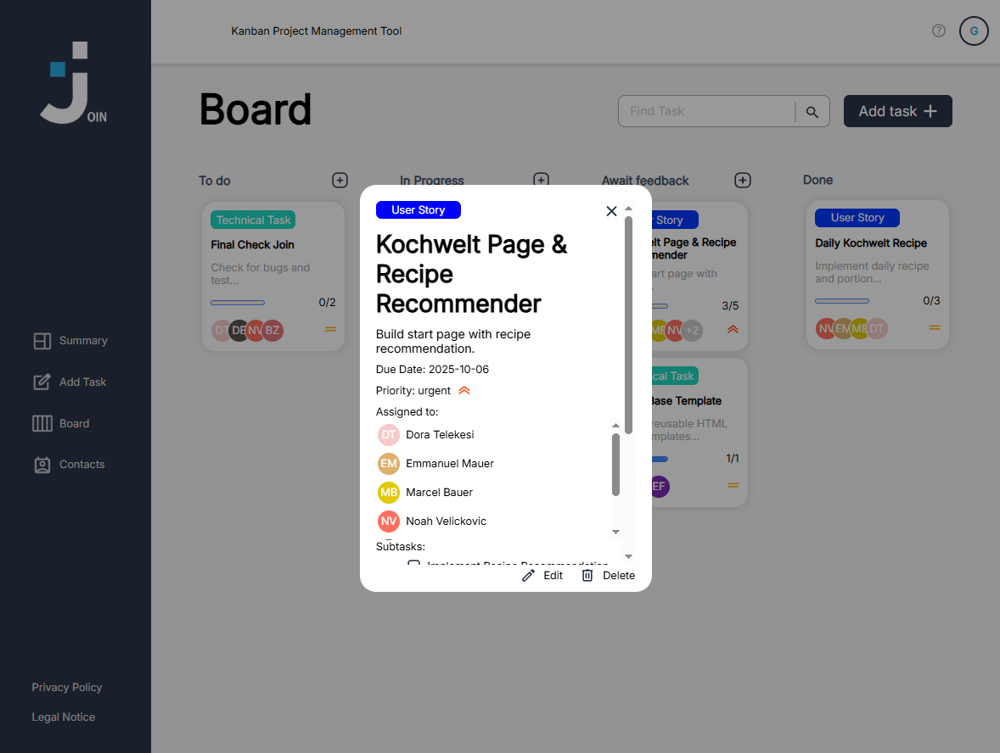
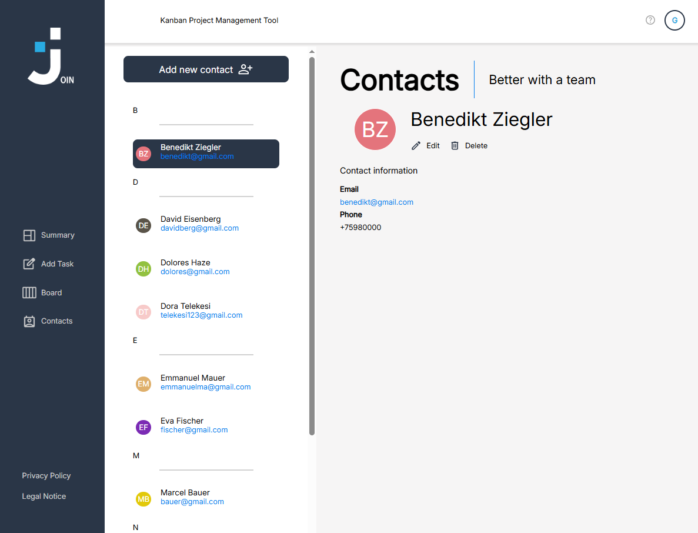
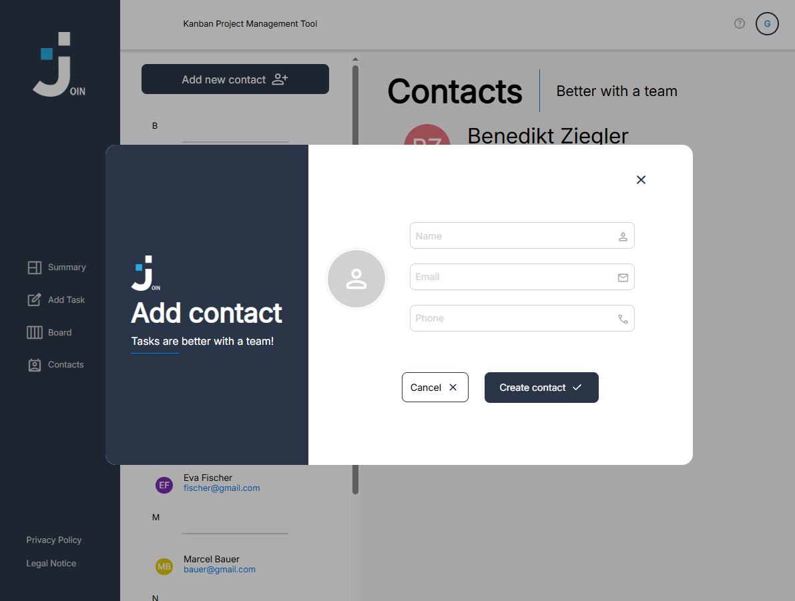
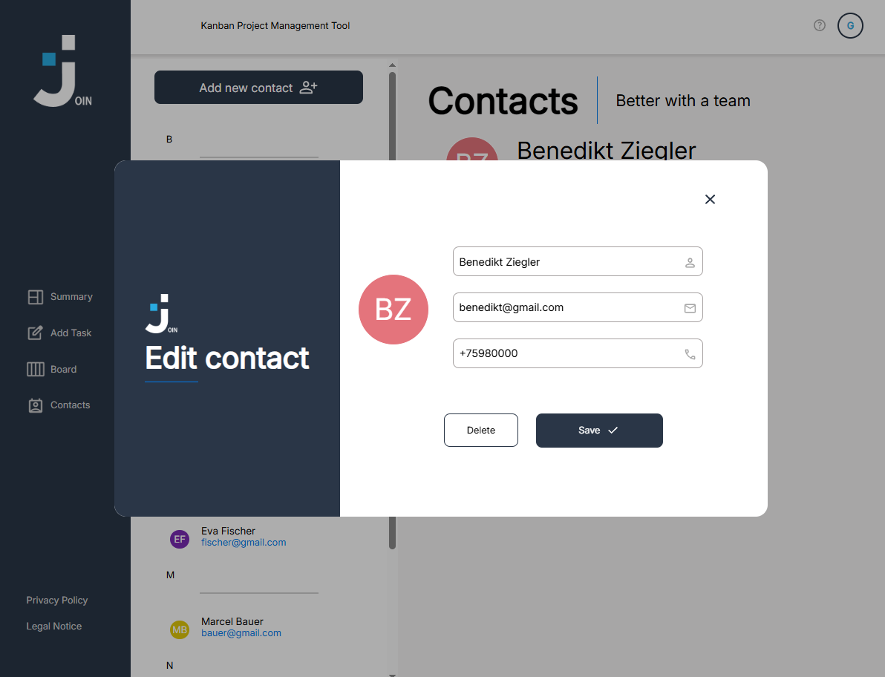
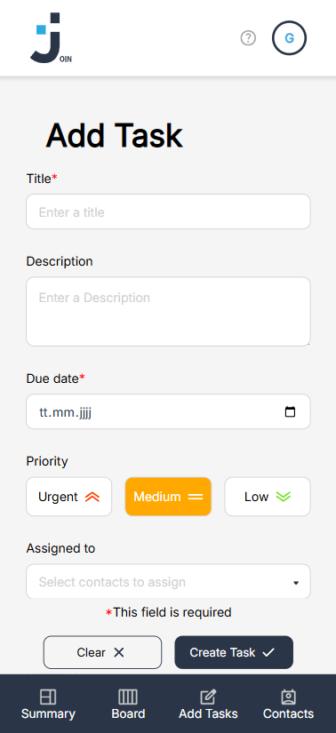
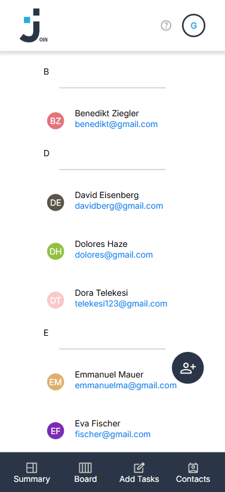
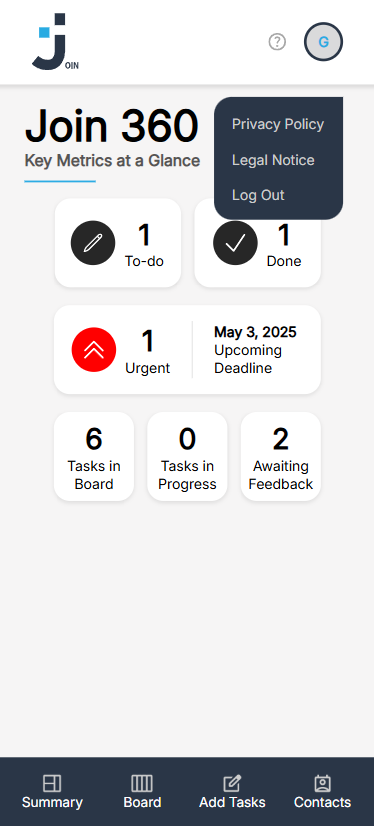
